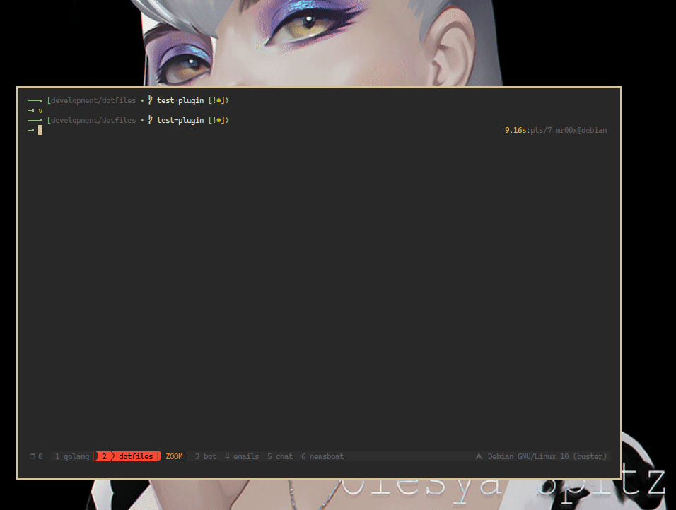

# [[[ MOVING TO LUA CONFIG!!! ]]]

  My Lovely :heart: Debian configs,

  > Some codes is not my original..they all belongs to credits people.
  > I just make some configs/refactoring for my needs

 
 artwork credits [olesyaspitz](https://www.instagram.com/olesyaspitz)

## Installation

> Don't forget to install stow `sudo apt install stow`

  1. Test linking

     ```sh
     $stow -nvSt <your_file_need_to_linking>
     ```

  2. Create/Remove linking

     ```sh
     $stow --adopt -vSt ~ <your_file_need_to_linking> # Start linking
     $stow --adopt -vDt ~ <your_file_need_to_linking> # Remove linking
     ```

  3. Or full install, run this command

     (WITH CAUTION!!) you have to know how stow works!!

     ```sh
     ./install.sh
     ```

## Credits/Thanks (inspiration and taken from..)

- [glepnir](https://github.com/glepnir/nvim)
- [elianiva](https://github.com/elianiva/dotfiles)
- ...and the others (can't remember their name/account)
